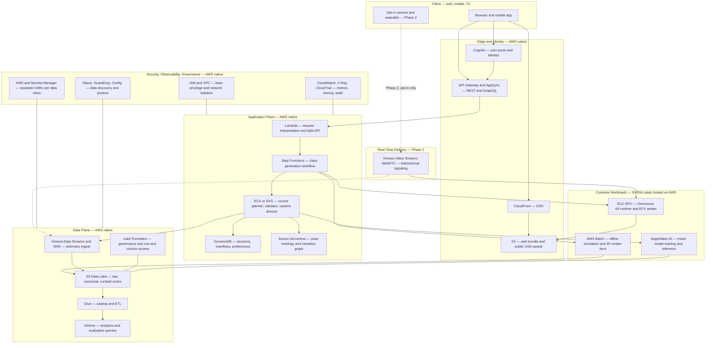

# Yogaboid — Investor Pitchbook

**Thesis:** Existing yoga apps personalize the *class*; Yogaboid is building a physics-first digital yoga teacher that personalizes the *body* — planning and performing an exact-duration, safety-constrained lesson from a validated pose graph, a yoga motor model, and a USD-native performance artifact.

**Core phrase:** *The body is the model.*

**Status disclosure (read first):** Yogaboid is **pre-implementation**. This repository today contains product and architecture specifications, a vendored agent-skill library, five read-only upstream research repositories, and ten reference papers. It contains **no Yogaboid application code, no pose ontology, no USD assets, and no trained models**. Every capability described below is labeled `[REPO]`, `[UPSTREAM]`, or `[PLANNED]` — see the [Claim-Status Table](#appendix-b--claim-status-table). Nothing in this document should be read as a shipped feature, a clinical claim, or a deployed system.

**Prepared:** 2026-07-27. **Name status:** *Yogaboid* is the finalized product name; the repository's north-star document still carries the earlier working title *Prana*.

---

## Deck Rules

| Rule | Value |
|---|---|
| **Slide budget** | **10 slides maximum.** Sections 1–10 below map 1:1 to slides. Appendices are *not* slides — they are the diligence pack and appear in the data room or as a follow-up memo. |
| **Design system** | **Moodboard 01 — "Embodied Intelligence."** Premium robotics lab meets precise human movement. |
| **Palette** | Graphite `#1B1C1E` (primary background) · Near-Black `#0B0C0D` (panel base) · Slate `#4A4A4A` (secondary surface) · Bone `#E7E2D3` (text / light neutral) · Saffron `#F5B34F` (motion, accent, single highlight per slide) |
| **Type** | Headings — Arial Black. Body — Arial. System fonts only, so the deck ports to PPTX without font embedding. |
| **Visual grammar** | One idea per slide. Dark field, one bone-white headline, one saffron accent element. Motion-trace arcs, not stock photography. No fake product UI. Every chart or diagram carries an "illustrative" or "proposed" label. |
| **Audience** | Institutional investors — pre-seed / seed. Assume one technical partner in the room and one generalist. |
| **Stage framing** | **Pre-seed / seed.** No repository evidence indicates a later stage: there is no shipped product, no revenue artifact, no user data, and no deployed infrastructure. Frame as a research-and-spec-stage company raising to build Phase 1. |
| **Honesty rule** | No shipped-language for roadmap items. Negative claims about competitors are phrased as *"not publicly documented in reviewed sources."* Every number, date, and third-party capability on a slide carries a URL. |
| **Claims to avoid** | No injury-prevention, pain-reduction, diagnostic, treatment, or clinical-validation claims. No wearable-adaptive *performance* claims. No unsourced TAM dollar figure. |

---

## Slide 1 — Cover: The body is the model.

**Takeaway:** Yogaboid is a physics-first digital yoga teacher — the class is computed from the body, not chosen from a menu.

**On-slide copy**

> # The body is the model.
>
> **YOGABOID**
>
> A physics-first personalized digital yoga teacher.
> Prompt in. An exact-duration, safety-constrained class performed by a photorealistic teacher out.
>
> `Pre-seed / seed · Pre-implementation: specifications and research assets, no shipped product`

**Recommended visual:** Full-bleed graphite field. Humanoid mannequin figure in a Warrior II–style pose, rim-lit, dark studio. Saffron motion-trace arcs sweep through the limbs to imply the transition the figure is mid-way through. Headline in Arial Black bone-white, lower-left. The pre-implementation line sits in small Slate type in the footer — visible, not hidden.

**Speaker note:** Open with the disclosure, not after it. "We are pre-implementation — what we have is a validated technical thesis, a specification, and the upstream research to build on. I'll show you why the timing is right and why this is buildable now rather than in 2021." Then deliver the phrase: every yoga app on the market personalizes the class. We personalize the body. That single sentence is the whole company. Do not use the word "shipped" anywhere in this deck.

**Sources:** Positioning derives from the repository's north-star product document (`# Idea Document: Generative Yoga Studio.md`) and architecture specification (`Given your target, treat this as a **USD.md`), both present in this repo. Design direction: Moodboard 01, "Embodied Intelligence." No external factual claim is made on this slide.

---

## Slide 2 — Problem: generated classes do not understand the body.

**Takeaway:** Yoga has become a mass-participation activity practiced mostly without supervision — and unsupervised practice is exactly where the documented harm concentrates.

**On-slide copy**

> ## Variety is solved. Physiology is not.
>
> **15.8%** of U.S. adults practiced yoga in 2022, up from **5.0%** in 2002.
> — [NCCIH](https://www.nccih.nih.gov/health/yoga-effectiveness-and-safety)
>
> A national survey of **1,702** practitioners identified **practicing only by self-study, without prior or current supervision**, as a risk factor for both acute and chronic adverse effects. **98.2%** of acute adverse effects involved the musculoskeletal system.
> — [Cramer et al., BMC Complementary Medicine, 2019](https://pmc.ncbi.nlm.nih.gov/articles/PMC6664709/)
>
> NCCIH: *"learning yoga on your own without supervision has been associated with increased risks."*
> — [NCCIH](https://www.nccih.nih.gov/health/yoga-effectiveness-and-safety)
>
> **Today's apps generate more classes. None of them observe the student.**

**Recommended visual:** Two-panel split on graphite. Left: a bone-white line rising from 5.0% to 15.8% — participation. Right: a saffron ring chart holding a single figure, 98.2%, labeled "acute adverse effects that were musculoskeletal." Beneath both, one Slate line: "The supervision layer never scaled with the practice." No stock imagery.

**Speaker note:** The problem is not demand and it is not content supply — both are abundant. The problem is that the fastest-growing form of practice is the form the evidence flags as riskiest: alone, at home, unobserved. Be precise here under diligence: Cramer et al. is a self-reported national survey identifying self-study as a *risk factor*, not a randomized trial, and we are describing a documented association. We are not claiming Yogaboid prevents injury — we are claiming the supervision gap is real, measured, and currently unaddressed by software.

**Sources:**
- https://www.nccih.nih.gov/health/yoga-effectiveness-and-safety
- https://pmc.ncbi.nlm.nih.gov/articles/PMC6664709/

---

## Slide 3 — Product: a physics-first personalized digital yoga teacher.

**Takeaway:** Yogaboid generates a pedagogically valid, physically validated, exactly-timed lesson and performs it through a photorealistic teacher — a generative studio, not a clip library.

**On-slide copy**

> ## Not a playlist. A studio.
>
> **What we are building** `[PLANNED]`
>
> - A **validated pose ontology** — each asana carries required contacts, joint demand, contraindications, approved modifications, and hold-time bounds
> - An **expert-reviewed transition graph** — the graph decides whether a transition is *pedagogically* valid; the motor model decides how it is *physically* performed
> - An **exact-duration solver** — the class ends when you asked it to end
> - **Continuous, physics-checked motion** — no cuts hiding disconnected clips
> - **Cameras that teach** — the shot reveals the anatomy the cue is about
> - **A composable OpenUSD lesson** — replayable, editable, regenerable from its manifest
>
> *Specification stage. No component is implemented today.*

**Recommended visual:** A single horizontal chain on graphite, each node a Near-Black chip with a bone-white label, connected by thin saffron arrows: `Prompt → Constraints → Pose graph → Motor model → Physics check → Camera direction → USD lesson`. A saffron `PROPOSED` tag sits at top-right of the diagram. Below, one line in Slate: "Every stage is specified; none is built."

**Speaker note:** The distinction that matters to a technical partner is the separation of concerns between the transition graph and the motor model. The graph is curated human yoga knowledge — a teacher-reviewed directed graph of which transitions are allowed for which level, preserving facing and contacts. The motor model never invents pedagogy; it only realizes an approved edge as continuous physical motion for the selected teacher, tempo, and modification. That separation is what makes the system auditable, and it is why a yoga professional can sign off on sequences without reviewing neural network weights. Note honestly: the repository's specification also sets a first-version boundary — the initial product personalizes from *declared* constraints and explicitly excludes webcam pose detection and automatic form correction. Observed student state is Phase 2, not v1.

**Sources:** Product definition, pose-ontology schema, transition-graph schema, exact-duration solver, camera grammar, USD layer policy, and the explicit v1 exclusion of webcam pose detection are all specified in `# Idea Document: Generative Yoga Studio.md` in this repository. OpenUSD as a composition and interchange standard: [Alliance for OpenUSD](https://aousd.org/).

---

## Slide 4 — Experience: from a sentence to a performed class.

**Takeaway:** One natural-language request becomes a deterministic, personalized, exactly-timed lesson performed on screen — and later, adapted while you practice.

**On-slide copy**

> ## "Give me twenty minutes."
>
> **The request**
> *"A 20-minute beginner evening class for tight hamstrings. Avoid wrist pressure. Teach slowly in Hindi with a calm female instructor. Use blocks. Himalayan studio at sunrise."*
>
> **What comes back** `[PLANNED]`
>
> | | |
> |---|---|
> | Course plan | intention, pose sequence, intensity profile |
> | Personalization | wrist-safe and hamstring modifications, not generic demos |
> | Performance | continuous breath-aware motion by a photorealistic teacher |
> | Direction | camera moves to the feet, hips, and spine as each cue lands |
> | Duration | **finishes at 20:00** — spec target: within 1 second of the request |
> | Artifact | the whole lesson preserved as editable OpenUSD layers |
>
> **Phase 1: personalized from what you declare. Phase 2: adapted from what we observe.**

**Recommended visual:** Left third — the prompt as literal typed text on Near-Black, cursor in saffron. Right two-thirds — a vertical timeline of the resulting class, bone-white pose labels, saffron transition arcs between them, and a hard saffron end-cap at `20:00`. Small saffron chips mark two moments: "camera → low side three-quarter" and "modification → hand on block."

**Speaker note:** This is the demo we build toward, and it is a *single continuous take* — that constraint is deliberate. Anyone can cut between clips; performing an approved transition continuously without foot-sliding, floor penetration, or a balance failure is the hard part, and it is what proves there is a motor model underneath rather than an editing trick. On duration: the one-second tolerance is a specification target from our design document, not a measured result. On the two phases: v1 personalizes from declared constraints — mobility limits, loads to avoid, props, level. Real-time adaptation from observed student state is Phase 2, and our own specification currently scopes webcam pose detection out of v1. I would rather tell you that now than have you find it in the doc.

**Sources:** The example prompt, the output contract, the exact-duration solver with a one-second tolerance, the deterministic course manifest, the USD layer stack, and the north-star demonstration are specified in `# Idea Document: Generative Yoga Studio.md` in this repository. The v1 exclusion of webcam pose detection, student skeleton tracking, and automatic form correction is stated in the same document. OpenUSD: [Alliance for OpenUSD](https://aousd.org/).

---

## Slide 5 — Technology: five layers, one auditable pipeline.

**Takeaway:** The class is produced by five separable layers — curated yoga knowledge, a motor model, physics and safety validation, camera direction, and a USD artifact — and the hard research problems are already solved upstream.

**On-slide copy**

> ## Curated knowledge on top. Physics underneath.
>
> | Layer | What it does | Status |
> |---|---|---|
> | **1. Transition graph** | Expert-reviewed directed graph of allowed transitions, with required contacts, facing, and max tempo. Decides *pedagogical* validity. | `[REPO]` specified |
> | **2. Yoga motor model** | Realizes an approved edge as continuous motion for the chosen teacher, tempo, and modification. | `[UPSTREAM]` + `[PLANNED]` |
> | **3. Physics + safety validation** | Contact, balance, sliding, penetration, joint-limit and velocity gates. Explainable rejection reports. | `[REPO]` specified |
> | **4. Camera director** | Converts each teaching cue into a camera objective; scores candidate shots for visibility, occlusion, and continuity. | `[REPO]` specified |
> | **5. USD lesson artifact** | Layered OpenUSD — teacher, wardrobe, environment, choreography, dialogue, cameras, lighting. Replayable and regenerable. | `[REPO]` specified |
>
> **Why this is buildable now:** generative motor control reached **a 99.98% success rate in reproducing a vast corpus of motion clips** ([GPC, arXiv 2606.29148](https://arxiv.org/abs/2606.29148)) · a single physics controller absorbs **ten thousand motion clips** in real time ([PHC, arXiv 2305.06456](https://arxiv.org/abs/2305.06456)) · muscle-level imitation controls **up to 290 muscles** with EMG-correlated activations from **1.8 hours** of data ([KINESIS, arXiv 2503.14637](https://arxiv.org/abs/2503.14637))

**Recommended visual:** A five-tier stack on graphite, drawn as horizontal Near-Black bars from top (curated yoga knowledge, bone-white) descending to bottom (physics, saffron-edged) — deliberately inverting the usual diagram so the human expertise sits *above* the machine layers. A saffron `PROPOSED ARCHITECTURE` tag at top-right. Status chips `[REPO] / [UPSTREAM] / [PLANNED]` sit at the right edge of each bar in small Arial.

**Speaker note:** The strategic point is that we are not building physics infrastructure. Simulation, retargeting, and physically-based control are published, open, and in this repository as read-only research references — ProtoMotions, MotionBricks, ARDY, GR00T whole-body control, and ten SIGGRAPH 2026 papers including GPC. What is *not* available off the shelf is the yoga-specific asset: the expert-approved transition graph, the modification ontology, the instructional camera grammar, and the evaluation data. That is what we build and that is what compounds. A diligence note I will volunteer: our own design document cites two GPC figures — a 600-hour corpus and a sub-1% parameter count for CoLA adaptation — to incorrect source URLs. I verified the 99.98% figure directly against the GPC arXiv abstract, and I am *not* using the other two, because I could not verify them from a primary source. Those unverified figures are flagged in our claim-status table.

**Sources:**
- GPC, "Large-Scale Generative Pretraining for Transferable Motor Control" — 99.98% success rate reproducing a large motion corpus, FSQ motion vocabulary, autoregressive controller, emergent perturbation-recovery: https://arxiv.org/abs/2606.29148
- Perpetual Humanoid Control — physics-based controller scaling to ten thousand motion clips, real-time, fault-tolerant: https://arxiv.org/abs/2305.06456
- KINESIS — musculoskeletal motion imitation, up to 290 muscles, 1.8 hours of training data, activations correlating with human EMG: https://arxiv.org/abs/2503.14637
- Vision-only yoga grading plateaus at Accuracy 0.8321 / F1 0.8204 on a 45-class single-image benchmark, with no temporal modeling and "no interpretable feedback": https://pmc.ncbi.nlm.nih.gov/articles/PMC8775687/
- OpenUSD governance and cinematic-scale scope: https://aousd.org/
- Upstream simulation and retargeting stack: https://developer.nvidia.com/isaac/gr00t · https://github.com/NVlabs/ProtoMotions · https://github.com/NVlabs/GR00T-WholeBodyControl · https://nvlabs.github.io/motionbricks/ · https://research.nvidia.com/labs/sil/projects/ardy/
- Layer definitions, validation requirements, and camera grammar: `# Idea Document: Generative Yoga Studio.md` and `Given your target, treat this as a **USD.md` in this repository.

---

## Slide 6 — Data moat: the corpus that only our loop produces.

**Takeaway:** Motor foundation models are commoditizing; the defensible asset is a paired corpus of expert-approved motion, corrections, and biomechanical response that can only be generated by running the product.

**On-slide copy**

> ## The model is downloadable. The corpus is not.
>
> NVIDIA publishes open motor foundation model weights on Hugging Face ([NVIDIA Isaac GR00T](https://developer.nvidia.com/isaac/gr00t)). So the model is not the moat.
>
> **Six asset classes we intend to accumulate** `[PLANNED — none of this data exists today]`
>
> 1. **Labeled yoga motion** — canonical, contact-annotated, world-grounded
> 2. **Approved transitions** — a teacher-reviewed graph, edge by edge
> 3. **Modification ontology** — the substitution that fits *this* limitation
> 4. **Teaching corrections** — expert rejections and rewrites of generated sequences
> 5. **Safety outcomes** — which constraint fired, and what the validator caught
> 6. **Student-state feedback** — declared in Phase 1, observed in Phase 2
>
> **The flywheel:** generate → expert reviews and corrects → corrections become graph edges, reward terms and validator rules → the next generation needs less correction → more classes generated per expert-hour → more corrections captured.
>
> **Second-order use:** the same physics-validated human motion corpus is the training substrate for humanoid retargeting — the [H2O](https://arxiv.org/abs/2403.04436) pipeline is built on exactly this shape of dataset.

**Recommended visual:** A closed saffron loop on graphite with four bone-white nodes — `Generate` → `Expert corrects` → `Graph, rewards, validators update` → `Less correction needed` — arrow thickness increasing around the cycle to imply compounding. Off the loop, a single dotted saffron branch to a Slate node labeled "humanoid retargeting corpus (research)." A saffron chip: `NO DATA COLLECTED TO DATE`.

**Speaker note:** Be blunt about the state: we have zero proprietary data today. What we have is a *specified* mechanism for producing it and a reason to believe it is not obtainable any other way. Video libraries and parameter-driven generators never observe or correct against a physical model, so catalog scale does not produce this corpus. The measurable version of the flywheel is expert-approval rate: our specification sets a target of a yoga professional approving at least 90% of generated sequences without structural edits. That is the number to underwrite — it is a direct read on whether corrections are compounding. The published measurement precedent for the correction loop itself is quantitative joint-angle error reduction under guidance, which has been demonstrated with research-grade sensing. And the honest caveat on the adherence argument: the strongest evidence is from an adjacent modality, digital physical therapy, not from yoga.

**Sources:**
- Open motor foundation models, open data pipelines, GR00T 1.7 weights on Hugging Face (Early Access, explicitly not production-supported): https://developer.nvidia.com/isaac/gr00t
- Joint-angle correction under guidance is quantitatively measurable — 11 IMUs, 95.39% posture-instance recognition, joint-angle error reductions of roughly 0.2, 0.1 and 0.5 rad at specific joints (research-grade hardware, not consumer parity): https://pmc.ncbi.nlm.nih.gov/articles/PMC6929085/
- Vision-only grading currently yields "only an overall grade with no interpretable feedback": https://pmc.ncbi.nlm.nih.gov/articles/PMC8775687/
- Retargeted-motion datasets as the substrate for RGB-camera whole-body humanoid control: https://arxiv.org/abs/2403.04436
- Adjacent-modality adherence evidence: remote sensor-guided care delivered 26.1 vs 13.4 sessions and 8.7% vs 20.5% dropout at non-inferior clinical outcomes: https://www.jmir.org/2023/1/e49236/
- Defensibility asset list and the 90% expert-approval MVP criterion: `# Idea Document: Generative Yoga Studio.md` in this repository.

---

## Slide 7 — Competitive wedge: where the category leader stops.

**Takeaway:** Down Dog has genuinely solved combinatorial class variety at near-zero marginal cost; no publicly documented part of any incumbent's yoga stack reasons about the body's mechanics — that is the opening.

**On-slide copy**

> ## Variety at the top. Physiology wide open.
>
> **Down Dog is a real product with a real moat.** It generates "a unique, personalized yoga practice every time" from user-set **time, level, focus, voice, and music** ([Down Dog](https://www.downdogapp.com/)), advertises **"over a million possible configurations"** and a **19-body-area Boost** feature ([Google Play](https://play.google.com/store/apps/details?id=com.downdogapp&hl=en_US)), and has delivered **160M+ practices with a team of 5 full-time** ([Down Dog jobs](https://www.downdogapp.com/jobs)). That is exceptional content-engine economics.
>
> | | Video library | Down Dog | Camera coach | Digital MSK care | **Yogaboid** |
> |---|---|---|---|---|---|
> | **Personalization unit** | catalog choice | session parameters | reps + form | clinician care plan | **the body's mechanics** `[PLANNED]` |
> | **Observes the student** | not documented | **not publicly documented in reviewed sources** | yes — **strength only** | yes | **Phase 2** `[PLANNED]` |
> | **Reasoning substrate** | fixed at recording | parameterized assembly | pose classification | CV score + clinician | **physics / motor model** `[PLANNED]` |
> | **Biomechanical safety model** | verbal caution | **not publicly documented in reviewed sources** | form cues, strength only | regulated pathway | **constraint-based planning** `[PLANNED]` |
> | **Output artifact** | 2D video | recorded segments | video + overlay | app guidance | **composable USD** `[PLANNED]` |
>
> **Our wedge:** embodied motion intelligence · physics and safety constraints · teacher-correction data · cinematic camera direction · reusable USD-native motion artifacts.

**Recommended visual:** The five-column matrix rendered on graphite, bone-white text, with only the Yogaboid column carrying a saffron left border and Near-Black fill. Cells reading "not publicly documented in reviewed sources" set in italic Slate at reduced weight — visually quiet, so the slide reads as an honest map rather than an attack. Footer chip in saffron: `Yogaboid column = planned, not shipped`.

**Speaker note:** Say the generous thing first and mean it: Down Dog's achievement is combinatorial variety at near-zero marginal cost with five people, and we are not going to out-vary them. Then be surgical about the phrasing. I am *not* claiming Down Dog "has no AI" or "cannot see you" — I have no visibility into their internals. What I can say is precisely this: across their homepage, FAQ, jobs page, terms, privacy policy and Google Play listing, camera-based pose feedback, wearable or vital-sign adaptation, physics simulation, biomechanical safety scoring and robot retargeting are not publicly documented, and the only health-data linkage described in their privacy policy is an opt-in one-way export of minutes practiced to Apple Health and Google Fit. If a diligence call finds otherwise, that phrasing survives; "they have no AI" would not. Note also that the mainstream camera player, Peloton IQ, ships form feedback for strength workouts only — vision coaching exists at consumer scale and has not been pointed at yoga. And note that Kemtai and Hinge Health prove markerless CV form-checking is deployable and, in Kemtai's case, regulated — which makes them plausible partners or infrastructure comparables as much as competitors.

**Sources:**
- Down Dog product surface, parameter-driven generation, configuration count, Boost across 19 body areas, 6 teacher voices, 13 languages: https://www.downdogapp.com/ · https://www.downdogapp.com/faq · https://play.google.com/store/apps/details?id=com.downdogapp&hl=en_US
- Down Dog scale and team size — 6 apps, 160M+ practices, 5 full-time staff: https://www.downdogapp.com/jobs
- Down Dog privacy policy — the only health-data reference is opt-in export of minutes practiced to Apple Health / Google Fit; no camera, video, pose or biometric collection appears: https://www.downdogapp.com/privacy
- Down Dog terms — the Service is described as "an education tool designed to help with various forms of fitness, health and wellbeing": https://www.downdogapp.com/terms
- Peloton IQ — movement-tracking camera with Form Feedback, strength workouts only: https://www.onepeloton.com/blog/what-is-peloton-iq
- Kemtai — 111 body data points, no sensors or wearables required, FDA-listed and CE-marked: https://kemtai.com/
- Hinge Health — computer-vision full-body precision tracking, real-time audio and visual feedback, HingeScore: https://www.hingehealth.com/gb/en/product/precision-motion-technology/
- Sword Health — public clinical-evidence program, the bar any health claim would be measured against: https://swordhealth.com/clinical-excellence/clinical-studies
- Glo — human-teacher library model, 25+ styles, 50+ instructors, no camera or sensor feedback mentioned: https://www.glo.com/
- No funding, valuation, revenue or user-count figure is asserted for any competitor; none was confirmed from a primary source.

---

## Slide 8 — Why now: three curves, all verified.

**Takeaway:** Demand scaled while supervision did not, spending shifted to depth rather than reach, and the physics-and-motor-model stack became an integration instead of a five-year build.

**On-slide copy**

> ## Three curves crossed.
>
> **1 · Participation grew; supervision did not.**
> U.S. adults practicing yoga rose from **5.0% (2002) to 15.8% (2022)** ([NCCIH](https://www.nccih.nih.gov/health/yoga-effectiveness-and-safety)), while U.S. emergency-department yoga injuries totaled **29,590 from 2001 to 2014**, with the rate rising from **9.55 to 17.01 per 100,000 participants** and reaching **57.9 per 100,000 for adults 65+ in 2014** ([Swain & McGwin, OJSM, 2016](https://pmc.ncbi.nlm.nih.gov/articles/PMC5117171/)).
>
> **2 · The market is paying for depth, not reach.**
> Global Health & Fitness app in-app purchase revenue hit a record **$4.5B in 2025, +13% YoY**, on **3.96B installs** growing only **+0.8%**. Share of H&F apps using AI-themed keywords rose from **19% (Q4 2024) to 28%** ([Sensor Tower](https://sensortower.com/blog/health-and-fitness-apps-ai)).
>
> **3 · The motor-model layer opened up.**
> Generative motor control now reproduces a large motion corpus at a **99.98% success rate** ([GPC](https://arxiv.org/abs/2606.29148)); muscle-level imitation controls **up to 290 muscles** from **1.8 hours** of data ([KINESIS](https://arxiv.org/abs/2503.14637)); and the simulation, retargeting and open-weights stack is downloadable today ([NVIDIA Isaac GR00T](https://developer.nvidia.com/isaac/gr00t)).
>
> *No TAM dollar figure is presented — no primary-source market-size number was confirmed.*

**Recommended visual:** Three narrow vertical panels on graphite, each with one bone-white number set very large in Arial Black and one Slate caption line beneath: `15.8%`, `$4.5B`, `99.98%`. A thin saffron rule runs across all three at the same height to imply convergence. Footer in Slate: "No market-size dollar figure asserted — none verified from a primary source."

**Speaker note:** Three metrics, deliberately. I could have put a market-size slide here and I did not, because no primary-source digital-fitness TAM figure survived verification and a number I cannot defend costs more in this room than it earns. Instead: participation is mass-scale and rising, the injury rate moved the wrong way over the period measured — and note the fastest-growing gym cohort is 65+, up 8.6% year over year, the same cohort carrying the 57.9-per-100,000 injury rate. On monetization: revenue up 13% on 0.8% install growth means users are paying more per user for perceived intelligence, and AI keyword adoption jumping from 19% to 28% in four quarters means this category is about to flood with AI *claims*. That flood is good for whoever can actually reason about the body and bad for everyone repackaging a catalog. Caveat I will state plainly: the injury data ends in 2014 and is emergency-department-presenting only, so it understates volume and does not describe the present year.

**Sources:**
- U.S. yoga participation 5.0% (2002) → 15.8% (2022); 8.4% of U.S. children aged 4–17 (2017); unsupervised self-study associated with increased risk: https://www.nccih.nih.gov/health/yoga-effectiveness-and-safety
- U.S. ED-treated yoga injuries 29,590 (2001–2014); rate 9.55 → 17.01 per 100,000; 57.9 per 100,000 for adults 65+ in 2014; trunk most-injured region at 46.6%: https://pmc.ncbi.nlm.nih.gov/articles/PMC5117171/
- Global Health & Fitness app IAP revenue $4.5B in 2025 (+13% YoY), 3.96B installs (+0.8%), AI-keyword share 19% → 28%: https://sensortower.com/blog/health-and-fitness-apps-ai
- U.S. fitness-facility members 81 million in 2025; yoga accounted for 17.7 million members; membership growth for age 65+ at +8.6% YoY (report released 2026-04-09): https://www.healthandfitness.org/81-million-americans-were-members-of-a-fitness-facility-in-2025-new-hfa-report-finds/
- Sensing substrate already in consumers' hands — 57% of U.S. adults own at least one wearable or connected health device (46% own a wearable specifically, vs 13% in 2015), 83% wear it 5+ days a week; survey fielded 2025-12-01 to 2025-12-23, n=8,000: https://rockhealth.com/insights/whats-your-score-insights-on-wearables-and-connected-devices-from-rock-healths-2025-consumer-adoption-survey/
- Global wearable shipments 145.7 million units in Q1 2026, +4.3% YoY: https://www.idc.com/promo/wearablevendor/
- GPC 99.98% success rate: https://arxiv.org/abs/2606.29148 · KINESIS 290 muscles from 1.8 hours: https://arxiv.org/abs/2503.14637 · open stack and GR00T 1.7 Early Access weights: https://developer.nvidia.com/isaac/gr00t

---

## Slide 9 — Build plan: AWS-native, four phases.

**Takeaway:** A proposed AWS-native control and data plane, with GPU rendering and motion-model training as workloads on top, delivered in four phases from spec validation to robotics-transfer research.

**On-slide copy**

> ## Proposed architecture — not deployed. Four phases.
>
> **AWS-native control and data plane** `[PROPOSED]`
> Delivery: [CloudFront](https://aws.amazon.com/cloudfront/) + [S3](https://aws.amazon.com/s3/) · Auth: [Cognito](https://aws.amazon.com/cognito/) · API: [API Gateway](https://aws.amazon.com/api-gateway/) / [AppSync](https://aws.amazon.com/appsync/) · Orchestration: [Lambda](https://aws.amazon.com/lambda/) + [Step Functions](https://aws.amazon.com/step-functions/) · Services: [ECS](https://aws.amazon.com/ecs/) / [EKS](https://aws.amazon.com/eks/) · Training & inference: [EC2 GPU](https://aws.amazon.com/ec2/instance-types/p5/) + [SageMaker AI](https://aws.amazon.com/sagemaker-ai/) · Offline render/sim: [AWS Batch](https://aws.amazon.com/batch/) · Data lake: S3 + [Glue](https://aws.amazon.com/glue/) + [Athena](https://aws.amazon.com/athena/) + [Lake Formation](https://aws.amazon.com/lake-formation/) · State: [DynamoDB](https://aws.amazon.com/dynamodb/) + [Aurora](https://aws.amazon.com/rds/aurora/) · Telemetry: [Kinesis](https://aws.amazon.com/kinesis/data-streams/) / [MSK](https://aws.amazon.com/msk/) · Real-time: [Kinesis Video Streams WebRTC](https://docs.aws.amazon.com/kinesisvideostreams-webrtc-dg/latest/devguide/kvswebrtc-intro.html) · Observability: [CloudWatch](https://aws.amazon.com/cloudwatch/) + [X-Ray](https://aws.amazon.com/xray/) + [CloudTrail](https://aws.amazon.com/cloudtrail/) · Security: [KMS](https://aws.amazon.com/kms/) + [Secrets Manager](https://aws.amazon.com/secrets-manager/) + [IAM](https://aws.amazon.com/iam/) + [VPC](https://aws.amazon.com/vpc/)
>
> **OpenUSD, Omniverse Kit and the NVIDIA training stack are workloads we host on AWS GPU capacity — they are not AWS-native services.** ([NVIDIA on AWS](https://aws.amazon.com/nvidia/) · [Omniverse](https://www.nvidia.com/en-us/omniverse/))
>
> | Phase | Objective | Exit milestone |
> |---|---|---|
> | **0** | Research & spec validation | Upstream repos reproduced; skeleton/coordinate/motion-format differences documented; architecture decision record and license matrix signed off |
> | **1** | Offline class generation | One teacher, one studio, 12 canonical states, English + Hindi; deterministic manifest; exact-duration solver inside spec tolerance; a yoga professional approves ≥90% of sequences without structural edits |
> | **2** | Real-time student-state adaptation | Opt-in camera and wearable input; in-session modification; measured joint-angle error reduction across attempts |
> | **3** | Robotics transfer research | Yoga motion corpus retargeted to a humanoid in simulation |
>
> *No AWS resources are provisioned today. Phase 1 targets are specification targets, not results.*

**Recommended visual:** A left-to-right four-band phase bar on graphite, bands widening slightly toward the right, Phase 0 in Slate and Phase 1 in saffron to show where the raise is spent. Above it, a very small greyed thumbnail of the full architecture diagram with a bone-white pointer to "Appendix A." A hard saffron banner across the top-left corner: `PROPOSED — NOTHING DEPLOYED`.

**Speaker note:** Two things to land. First, the boring-on-purpose choice: everything that can be managed AWS is managed AWS, because our scarce engineering time belongs in the yoga ontology and the motion pipeline, not in operating a control plane. Second, the honest split: Omniverse Kit, RTX rendering, and the motion-model training stack are NVIDIA workloads we run on AWS GPU instances — I am not going to describe them as AWS services, because a technical partner will catch it. On phasing: Phase 1 is deliberately offline and camera-free, matching our own specification's v1 exclusions, which means the seed money buys a provable artifact — a generated, expert-approved, exactly-timed lesson — before we take on the privacy and latency surface of live camera input in Phase 2. Full component rationale, security boundaries and the architecture diagram are in Appendix A.

**Sources:** All AWS service references above link to official AWS product or documentation pages; the full list with rationale is in [Appendix A](#appendix-a--proposed-aws-architecture). Phase definitions derive from the development phases, MVP scope and MVP success criteria specified in `# Idea Document: Generative Yoga Studio.md`, and the platform split and license-matrix requirement in `Given your target, treat this as a **USD.md`, both in this repository. Upstream reproduction targets: https://github.com/NVlabs/ProtoMotions · https://github.com/NVlabs/GR00T-WholeBodyControl · https://nvlabs.github.io/motionbricks/ · https://research.nvidia.com/labs/sil/projects/ardy/

---

## Slide 10 — Vision and ask: a foundation model for embodied instruction.

**Takeaway:** Yoga is the beachhead; the durable asset is a foundation model for embodied movement instruction, and the ask funds Phase 1 to a provable artifact.

**On-slide copy**

> ## Yoga is the wedge. Embodied instruction is the company.
>
> Every skill taught by a body to a body — yoga, rehabilitation exercise, strength technique, dance, physical trades — currently depends on a human in the room. The asset we accumulate is not a yoga app. It is **a foundation model for embodied movement instruction, beginning with yoga.**
>
> Because the motion representation is **USD-native** — a standard governed by Pixar, Adobe, Apple, Autodesk and NVIDIA ([AOUSD](https://aousd.org/)) — the same artifact renders a cinematic teacher today and retargets to a humanoid tomorrow. Real-time whole-body humanoid control from a single RGB camera is **published work, not speculation** ([H2O, arXiv 2403.04436](https://arxiv.org/abs/2403.04436)), on an open reference stack ([NVIDIA Isaac GR00T](https://developer.nvidia.com/isaac/gr00t)), with home humanoids an announced product direction ([Figure AI](https://www.figure.ai/)).
>
> ### The ask
>
> **`[PLACEHOLDER — $X.XM pre-seed / seed]`** *(amount not yet set; insert before any external send)*
>
> **Use of funds — to a provable Phase 1 artifact**
> 1. Yoga ontology and expert-reviewed transition graph
> 2. Motion pipeline: capture, canonicalization, physics validation
> 3. USD asset pipeline and one photorealistic teacher
> 4. AWS Phase 0–1 environment and offline generation service
> 5. Founding yoga-expert review panel
>
> **What we will be able to show:** a generated, expert-approved, exactly-timed lesson, performed continuously, regenerable from its manifest.

**Recommended visual:** Return to the cover figure, but rendered three times across the slide in decreasing opacity: mannequin → photorealistic teacher → humanoid, connected by one continuous saffron motion trace passing through all three. Bone-white headline top-left. The ask sits in a Near-Black panel bottom-right with the placeholder bracket visibly bracketed so no one mistakes it for a real number.

**Speaker note:** Land the optionality without overreaching. The reason USD matters commercially rather than aesthetically is that it is a distribution argument: author the motion once, ship it to an app, a headset, or a robot simulator, on a standard controlled by the five companies that own creative tooling and the OS surfaces. And I want to be careful about the robotics slide — I am not claiming we are a robotics company. I am claiming the corpus we build for the consumer product is the same shape of dataset that published human-to-humanoid retargeting work already trains on, so the consumer business funds an option on embodiment rather than requiring a bet on it. On the ask: the amount is a placeholder and must be set before this deck leaves the building. What I will commit to is the artifact — Phase 1 ends with a lesson a yoga professional signs off on, not a demo reel.

**Sources:**
- OpenUSD scope, governance, and founding members Pixar, Adobe, Apple, Autodesk, NVIDIA: https://aousd.org/
- H2O — first demonstration of learning-based real-time whole-body humanoid teleoperation from a single RGB camera; scalable sim-to-data retargeting: https://arxiv.org/abs/2403.04436
- NVIDIA Isaac GR00T — open reference platform, open foundation model, Omniverse/Cosmos simulation, GR00T 1.7 weights on Hugging Face (Early Access, not production-supported): https://developer.nvidia.com/isaac/gr00t
- GR00T N1 dual-system VLA architecture, deployed on a Fourier GR-1 humanoid: https://arxiv.org/abs/2503.14734
- Figure AI — general-purpose humanoid for the home, Figure 03 and the Helix model: https://www.figure.ai/
- "A foundation model for embodied movement instruction, beginning with yoga" and the business-model options are stated in `# Idea Document: Generative Yoga Studio.md` in this repository.

---
---

# Appendices — Diligence Pack

*Not slides. These sections support the deck in the data room and in technical diligence calls.*

---

## Appendix A — Proposed AWS Architecture

> ### ⚠️ PROPOSED ARCHITECTURE — NOT DEPLOYED STATE
>
> **No AWS account, VPC, cluster, bucket, table, model endpoint, or pipeline described in this appendix exists today.** This is a target architecture derived from the requirements in the repository's specification documents. Every component is a design intention. Nothing here has been provisioned, benchmarked, cost-modeled against real traffic, or security-reviewed by a third party. Treat all component choices as revisable at Phase 0 exit.

### A.1 Design principles

1. **Managed AWS by default.** Scarce engineering time belongs in the yoga ontology, the motion pipeline, and the evaluation harness — not in operating a control plane. Prefer managed services wherever the workload fits, per the [AWS Well-Architected Framework](https://docs.aws.amazon.com/wellarchitected/latest/framework/welcome.html).
2. **AWS is the platform; NVIDIA is a workload.** OpenUSD, Omniverse Kit, RTX rendering, Isaac Lab, and PyTorch motion-model training run **on** AWS GPU capacity. They are not AWS-native services and are never described as such. ([NVIDIA on AWS](https://aws.amazon.com/nvidia/) · [Omniverse](https://www.nvidia.com/en-us/omniverse/) · [Omniverse deployment docs](https://docs.omniverse.nvidia.com/ovas/latest/index.html))
3. **Identity and motion telemetry are separated by design.** Account identity lives in one store under one key policy; motion and camera-derived telemetry live in another, joined only through a pseudonymous subject key. See [A.4](#a4-security-and-privacy-boundaries).
4. **Offline before real-time.** Phase 1 is a batch generation pipeline. Real-time bidirectional media is deliberately deferred to Phase 2 so the privacy and latency surface arrives after the core artifact is proven.
5. **No clinical scope.** Architecture choices deliberately avoid anything that would imply a regulated medical device or a clinical data platform. See [A.5](#a5-services-deliberately-not-adopted).

### A.2 Architecture diagram

### A.3 Component rationale

| Concern | Proposed service | Why |
|---|---|---|
| Web and asset delivery | [CloudFront](https://aws.amazon.com/cloudfront/) + [S3](https://aws.amazon.com/s3/) | Static app bundle and immutable USD/render artifacts are cache-friendly; large binary USD payloads and value clips benefit from edge distribution. |
| Auth and identity | [Cognito](https://aws.amazon.com/cognito/) | Managed user pools, federated sign-in, and token issuance without operating an identity service. Identity store is deliberately isolated from motion telemetry. |
| Public API | [API Gateway](https://aws.amazon.com/api-gateway/) (REST/HTTP) + [AppSync](https://aws.amazon.com/appsync/) (GraphQL subscriptions) | API Gateway for the generation and account API; AppSync for live class-progress subscriptions in Phase 2. |
| Workflow orchestration | [Step Functions](https://aws.amazon.com/step-functions/) + [Lambda](https://aws.amazon.com/lambda/) | Class generation is a long, multi-stage, retry-heavy pipeline — interpret → plan → validate → compose motion → direct cameras → compose USD → render. Step Functions gives auditable per-stage state, which matters when a validator rejects a sequence. |
| Long-running services | [ECS Fargate](https://aws.amazon.com/ecs/), escalating to [EKS](https://aws.amazon.com/eks/) | Course planner, yoga validator, motion-quality QC, and camera director are containerized services with non-trivial dependency trees. Start on Fargate; move to EKS only when GPU scheduling and multi-tenant bin-packing justify it. |
| Model training | [SageMaker AI](https://aws.amazon.com/sagemaker-ai/) + [EC2 GPU instances](https://aws.amazon.com/ec2/instance-types/p5/) | SageMaker for managed training jobs, experiment tracking, and endpoints. Raw EC2 GPU where the NVIDIA stack needs specific driver, container, or simulator configurations. **Instance family selection is deferred to Phase 0 benchmarking** — no specific instance-type performance or cost claim is made here. ([GPU instance families](https://aws.amazon.com/ec2/instance-types/g6/)) |
| Interactive render runtime | [EC2 GPU](https://aws.amazon.com/ec2/instance-types/p5/) hosting Omniverse Kit | The repository specification requires a custom Omniverse Kit application streaming an RTX-rendered viewport rather than client-side WebGL. That is a GPU workload we host, not an AWS service. ([NVIDIA on AWS](https://aws.amazon.com/nvidia/)) |
| Offline render and simulation | [AWS Batch](https://aws.amazon.com/batch/) | 4K offline lesson renders, physics validation sweeps, and perturbation testing are embarrassingly parallel batch jobs with no latency requirement — the cheapest place to spend GPU. |
| Data lake | [S3](https://aws.amazon.com/s3/) + [Glue](https://aws.amazon.com/glue/) + [Athena](https://aws.amazon.com/athena/) + [Lake Formation](https://aws.amazon.com/lake-formation/) | Motion corpora, annotations, expert corrections, validator outcomes, and evaluation results in raw/canonical/curated zones. Lake Formation enforces fine-grained access so analysts query motion features without access to identity columns. Cold corpora tier to [Glacier](https://aws.amazon.com/s3/storage-classes/glacier/). |
| Product state | [DynamoDB](https://aws.amazon.com/dynamodb/) + [Aurora Serverless](https://aws.amazon.com/rds/aurora/) | DynamoDB for high-volume session state, manifests, and preferences. Aurora for the pose ontology and transition graph, which are relational, heavily constrained, and need transactional expert-review workflows. |
| Telemetry | [Kinesis Data Streams](https://aws.amazon.com/kinesis/data-streams/), [MSK](https://aws.amazon.com/msk/) if Kafka compatibility is required | Session events, validator outcomes, and Phase 2 derived motion features stream to the lake. Events are pseudonymous at the point of production. |
| Event fan-out and queues | [EventBridge](https://aws.amazon.com/eventbridge/) + [SQS](https://aws.amazon.com/sqs/) | Decouple expert-review notifications, render completion, and correction-job dispatch. |
| Real-time delivery | [Kinesis Video Streams WebRTC](https://docs.aws.amazon.com/kinesisvideostreams-webrtc-dg/latest/devguide/kvswebrtc-intro.html); [IVS](https://aws.amazon.com/ivs/) as a one-way alternative | Phase 2 needs low-latency bidirectional media — camera frames or derived features up, rendered viewport down. KVS WebRTC provides managed signaling and STUN/TURN. IVS is the fallback if delivery stays one-way. **To be validated against latency targets at Phase 2 entry.** |
| Observability | [CloudWatch](https://aws.amazon.com/cloudwatch/) + [X-Ray](https://aws.amazon.com/xray/) + [CloudTrail](https://aws.amazon.com/cloudtrail/) | Per-stage generation metrics, distributed traces across the Step Functions pipeline, and an immutable audit trail of every access to motion data. |
| Secrets and keys | [KMS](https://aws.amazon.com/kms/) + [Secrets Manager](https://aws.amazon.com/secrets-manager/) | Separate customer-managed keys per data class — identity, motion telemetry, raw media — so key policy alone can deny cross-class access. |
| Network and access | [IAM](https://aws.amazon.com/iam/) + [VPC](https://aws.amazon.com/vpc/) + [Organizations](https://aws.amazon.com/organizations/) | Least-privilege roles, private subnets for all data-plane and GPU compute, separate accounts per environment. |
| Data posture | [Macie](https://aws.amazon.com/macie/) + [GuardDuty](https://aws.amazon.com/guardduty/) + [Config](https://aws.amazon.com/config/) | Detect sensitive data landing in the wrong zone, detect anomalous access, and enforce configuration guardrails such as "no public buckets in the motion lake." |
| Compliance artifacts | [AWS Artifact](https://aws.amazon.com/artifact/) | Retrieve AWS-side compliance reports if an enterprise or hospitality customer requires them. Does **not** confer any certification on Yogaboid. |

### A.4 Security and privacy boundaries

Camera and wearable data are the highest-risk surface in this product, and they arrive in **Phase 2 only**. The following boundaries are design commitments, to be implemented and independently reviewed before any camera feature is enabled for a real user.

**Consent**
- Camera and wearable input are **opt-in per capability, per session** — never bundled into terms acceptance, never on by default, and revocable in-session with a single control.
- Consent is versioned and recorded as an auditable event ([CloudTrail](https://aws.amazon.com/cloudtrail/)); a capability cannot run without a currently-valid consent record.
- Declining camera or wearable input degrades to the Phase 1 experience — a fully functional class personalized from declared constraints. Observation is never a paywall.

**Data minimization**
- **Default: raw video never leaves the device.** The target design extracts pose and derived motion features on-device and transmits features, not frames.
- Raw frames are uploaded **only** on an explicit, separate, time-boxed opt-in for a specific purpose such as expert review or model debugging, into a dedicated bucket with its own CMK, its own retention clock, and its own access role.
- Wearable input is scoped to the minimum signals needed — no continuous location, no contact lists, no unrelated health records.

**Separation of identity and motion telemetry**
- Account identity ([Cognito](https://aws.amazon.com/cognito/) + identity tables) and motion telemetry (lake + streams) live in **separate stores, separate KMS CMKs, and separate IAM role boundaries**.
- Telemetry carries a **pseudonymous subject key**, not a user ID, email, or device identifier. The mapping table lives on the identity side and is accessible to a small number of narrowly-scoped roles, with every access logged.
- Analytics, evaluation, and model-training roles are granted access to the motion lake **without** access to the mapping table, enforced by [Lake Formation](https://aws.amazon.com/lake-formation/) fine-grained permissions and key policy. Column-level and row-level grants make the identity join structurally unavailable, not merely discouraged.
- Model training consumes **curated, pseudonymous** motion features. Raw-media buckets are excluded from training-role policies.

**Retention**
- Retention is per data class, shortest-first, enforced by S3 lifecycle policy rather than by application code:
  - Raw media on explicit opt-in — **shortest window**, deleted on a fixed clock or at consent revocation, whichever is first.
  - Derived motion features — retained for the personalization and evaluation purpose disclosed at consent, with a defined expiry.
  - Aggregate, non-reidentifiable evaluation metrics — retained indefinitely.
- **Deletion is a first-class product operation.** A deletion request must propagate to the lake, stream backlogs, derived feature tables, backups, and any training-set snapshot manifest. Because pseudonymous data enters model training, the design must define in advance whether deletion triggers exclusion from future training runs and how already-trained artifacts are handled — this is a known open design question, flagged in [Appendix C](#appendix-c--top-diligence-risks-and-gaps).
- Data residency and cross-region replication policy are set per market before launch in that market.

**No clinical claims**
- Yogaboid is **wellness and education software**. It is **not** a medical device, diagnostic tool, or treatment.
- The product does not diagnose, does not treat, does not screen for pathology, and does not claim to prevent injury or reduce pain.
- Safety constraints are described as **content and load constraints on a generated class**, not as clinical risk assessment.
- No claim of HIPAA compliance, FDA clearance or listing, or CE marking is made. Kemtai's FDA-listed and CE-marked status ([Kemtai](https://kemtai.com/)) and Sword Health's published clinical-evidence program ([Sword Health](https://swordhealth.com/clinical-excellence/clinical-studies)) illustrate the regulatory posture that *would* be required if we ever made a clinical claim — a deliberate decision to stay outside that scope in Phases 0–2.
- Wearable-derived adaptation is framed as **negative-response and overtraining avoidance**, never as a performance or fitness-outcome claim. A meta-analysis of HRV-guided training found **no statistically significant advantage** on VO₂max or endurance performance ([PMC8507742](https://pmc.ncbi.nlm.nih.gov/articles/PMC8507742/)); the significant finding was on vagal-mediated HRV with "less likelihood of negative responses."
- Marketing, in-product copy, and this pitchbook are subject to a claims review before any external use.

### A.5 Services deliberately NOT adopted

| Service | Decision | Reason |
|---|---|---|
| [AWS HealthLake](https://aws.amazon.com/healthlake/) | **Not adopted** | HealthLake is a HIPAA-eligible FHIR data store for clinical health records. Yogaboid holds no clinical records, no diagnoses, and no provider data. Adopting it would misrepresent our data model and **imply a clinical or medical-device posture we explicitly disclaim**. Revisit only if a future regulated care-delivery partnership genuinely requires FHIR interoperability, and only alongside the corresponding compliance program. |
| [HIPAA-eligible service configuration](https://aws.amazon.com/compliance/hipaa-eligible-services-reference/) | **Not claimed** | AWS services being HIPAA-eligible confers nothing on Yogaboid. We make no HIPAA claim. |
| Client-side WebGL/Three.js avatar rendering | **Not adopted** | The repository architecture specification explicitly rejects it in favor of a USD-native pipeline with server-side RTX rendering and viewport streaming. |
| Isaac Lab as product runtime | **Not adopted as runtime** | Per the repository specification, Isaac Lab is an optional physics and motion R&D dependency only; the product runtime is a custom Omniverse Kit application. |

### A.6 Phased build

| Phase | Objective | Scope | AWS footprint | Exit criteria |
|---|---|---|---|---|
| **Phase 0** — Research and spec validation | Prove the upstream stack reproduces and the specification survives contact with it | Reproduce ProtoMotions SMPL tracking and MaskedMimic control; run MotionBricks and ARDY; index the ten reference papers; document skeleton, coordinate-system and motion-format differences; produce an architecture decision record, repository compatibility matrix, pinned environments, and an NVIDIA/ACE **license matrix** before any commercial adoption | Single dev account. [EC2 GPU](https://aws.amazon.com/ec2/instance-types/p5/) dev instances, [S3](https://aws.amazon.com/s3/) scratch, [SageMaker AI](https://aws.amazon.com/sagemaker-ai/) experiment tracking. No production plane. **GPU instance family selected here by benchmark, not asserted in advance.** | Upstream reproduced and documented; ADR, compatibility matrix and license matrix signed off; minimal end-to-end USD avatar test passing; go/no-go on the Phase 1 architecture |
| **Phase 1** — Offline class generation | A generated, expert-approved, exactly-timed lesson — **no camera, no student observation** | Pose ontology and expert-reviewed transition graph for the initial canonical pose set; modification ontology; exact-duration solver; deterministic course manifest; continuous physics-checked motion inside approved edges; camera director and shot grammar; layered USD lesson; one photorealistic teacher, one studio, English and Hindi; 4K offline render | Full AWS-native control plane: [CloudFront](https://aws.amazon.com/cloudfront/)/[S3](https://aws.amazon.com/s3/), [Cognito](https://aws.amazon.com/cognito/), [API Gateway](https://aws.amazon.com/api-gateway/), [Step Functions](https://aws.amazon.com/step-functions/)/[Lambda](https://aws.amazon.com/lambda/), [ECS](https://aws.amazon.com/ecs/), [DynamoDB](https://aws.amazon.com/dynamodb/)/[Aurora](https://aws.amazon.com/rds/aurora/), [S3 lake](https://aws.amazon.com/s3/) + [Glue](https://aws.amazon.com/glue/)/[Athena](https://aws.amazon.com/athena/)/[Lake Formation](https://aws.amazon.com/lake-formation/), [AWS Batch](https://aws.amazon.com/batch/) render farm, [CloudWatch](https://aws.amazon.com/cloudwatch/)/[X-Ray](https://aws.amazon.com/xray/)/[CloudTrail](https://aws.amazon.com/cloudtrail/), [KMS](https://aws.amazon.com/kms/)/[Secrets Manager](https://aws.amazon.com/secrets-manager/) | Course duration within the specification tolerance; all transitions from the approved graph; continuous motion without cuts concealing discontinuities; every major alignment cue receives an appropriate shot; lesson regenerable from its manifest; **a yoga professional approves ≥90% of generated sequences without structural edits** |
| **Phase 2** — Real-time student-state adaptation | Adapt the class from observed state, under opt-in consent | On-device pose extraction; opt-in camera and wearable input; in-session modification and load adjustment; the measure → cue → re-measure loop; privacy architecture in [A.4](#a4-security-and-privacy-boundaries) implemented and independently reviewed **before** any real-user enablement | Adds [Kinesis Video Streams WebRTC](https://docs.aws.amazon.com/kinesisvideostreams-webrtc-dg/latest/devguide/kvswebrtc-intro.html), [AppSync](https://aws.amazon.com/appsync/) subscriptions, [Kinesis](https://aws.amazon.com/kinesis/data-streams/)/[MSK](https://aws.amazon.com/msk/) telemetry, separated identity/telemetry CMKs, [Macie](https://aws.amazon.com/macie/)/[GuardDuty](https://aws.amazon.com/guardduty/)/[Config](https://aws.amazon.com/config/) | Measured joint-angle error reduction across successive attempts within a session; consent, retention and deletion paths verified end to end; external privacy and security review passed; **note this phase reverses a v1 exclusion in the current specification and requires an explicit scope decision** |
| **Phase 3** — Robotics transfer research | Establish the second-order value of the corpus | Retarget the physics-validated yoga motion corpus to a humanoid **in simulation**; evaluate against published RGB-to-humanoid retargeting approaches ([H2O](https://arxiv.org/abs/2403.04436)) on the open reference stack ([Isaac GR00T](https://developer.nvidia.com/isaac/gr00t)) | [AWS Batch](https://aws.amazon.com/batch/) simulation sweeps, [SageMaker AI](https://aws.amazon.com/sagemaker-ai/) training, [S3](https://aws.amazon.com/s3/) corpus. Research account, isolated from production | A published or internally reproducible retargeting result on the Yogaboid corpus. **Research only — no physical robot deployment is in scope** |

---

## Appendix B — Claim-Status Table

**Legend**

| Tag | Meaning |
|---|---|
| `[REPO]` | **Present in repo today** — the artifact exists in this repository and can be opened right now. For specification documents this means *the spec exists*, not that the described system exists. |
| `[UPSTREAM]` | **Validated upstream research** — published by a third party with a citable primary source. Not Yogaboid's result. |
| `[PLANNED]` | **Planned Yogaboid capability** — designed and specified, not built. No implementation, no data, no measurement. |
| `[UNVERIFIED]` | **Appears in repository documents but could not be confirmed from a primary source. Not used as a claim in this deck.** |

### B.1 Repository contents — what actually exists today

| Artifact | Status | Notes |
|---|---|---|
| `# Idea Document: Generative Yoga Studio.md` — north-star product specification | `[REPO]` | Vision, pose ontology schema, transition graph schema, exact-duration solver, camera grammar, USD layer policy, agent decomposition, validation requirements, MVP scope and criteria, development phases, business models, defensibility, risks. Still carries the earlier working title *Prana*. |
| `Given your target, treat this as a **USD.md` — technical architecture specification | `[REPO]` | USD-native pipeline, Omniverse Kit runtime decision, repositories to study, papers by priority, agent skill contracts, platform split, USD asset structure, license-matrix caution. |
| `AGENTS.md` | `[REPO]` | Agent conventions; points to the two specs and to `references/` and `external/`. |
| `README.md` | `[REPO]` | One line: "Keep updating this as we hit milestones!" |
| `external/` — 5 upstream research repositories | `[REPO]` (read-only reference) | `ardy`, `groot-wbc`, `motionbricks`, `neuralappearance`, `protomotions`. Treated as read-only research reference code per `AGENTS.md`. |
| `references/papers/siggraph-2026/` — 10 reference papers | `[REPO]` | Motion: GPC, MotionBricks, ARDY. Rendering: ReSTIR LOD, Taming Optimization Variance, VideoNeuMat, Richer Material Generation, Multi-Layer Reservoir Splatting, NILE. Physics: Mixed MPM. |
| `.agents/skills/` + `skills-lock.json` | `[REPO]` | Vendored agent-skill library and lockfile. General-purpose tooling, not Yogaboid product code. |
| **Yogaboid application code** | **absent** | No `apps/`, no `extensions/`, no `models/`, no service code. |
| **Pose ontology / transition graph data** | **absent** | Schemas are specified; no instance data exists. |
| **USD assets — teachers, environments, props, lessons** | **absent** | No `usd/` or `assets/` tree. |
| **Trained models or checkpoints** | **absent** | No Yogaboid-trained artifact. |
| **Deployed infrastructure** | **absent** | No IaC, no AWS resources, no CI/CD for a product. |
| **Proprietary motion, correction, or student data** | **absent** | Zero records collected. |

### B.2 Capability claims

| Claim used in this deck | Status | Primary source |
|---|---|---|
| Expert-reviewed transition graph decides pedagogical validity; motor model realizes approved edges | `[REPO]` spec · `[PLANNED]` implementation | `# Idea Document: Generative Yoga Studio.md` |
| Validated pose ontology with contacts, joint demand, contraindications, modifications, hold bounds | `[REPO]` spec · `[PLANNED]` implementation | same |
| Exact-duration solver, one-second tolerance | `[REPO]` **spec target** · `[PLANNED]` | same — target, not a measured result |
| Physics, contact, balance, sliding, penetration validation gates | `[REPO]` spec · `[PLANNED]` | same |
| Semantic camera director and instructional shot grammar | `[REPO]` spec · `[PLANNED]` | same |
| Layered OpenUSD lesson, regenerable from manifest | `[REPO]` spec · `[PLANNED]` | same + `Given your target, treat this as a **USD.md` |
| ≥90% expert approval of generated sequences without structural edits | `[REPO]` **MVP criterion** · `[PLANNED]` | same — a target to be underwritten, not achieved |
| Camera-based student observation and automatic form correction | `[PLANNED]` — **Phase 2, and explicitly excluded from v1 in the current spec** | same. This is a scope reversal requiring an explicit decision. |
| Humanoid retargeting of the Yogaboid corpus | `[PLANNED]` — Phase 3, simulation only | same |
| AWS architecture in Appendix A | `[PLANNED]` / **PROPOSED** | Nothing provisioned. |
| Generative motor control reproduces a large motion corpus at **99.98% success rate**; FSQ motion vocabulary; GPT-style autoregressive controller; emergent perturbation-recovery and fall-recovery behaviors | `[UPSTREAM]` — **verified directly against the arXiv abstract** | https://arxiv.org/abs/2606.29148 |
| GPC scaled to **600 hours** of movement | `[UNVERIFIED]` — **not used** | Appears in the repository idea document, cited there to two unrelated Apple HealthKit documentation URLs. Not present in the GPC arXiv abstract. **Do not put on a slide.** |
| CoLA adaptation adds **less than 1% new parameters** | `[UNVERIFIED]` — **not used** | Appears in the repository idea document with the same incorrect citations. Not present in the GPC arXiv abstract. **Do not put on a slide.** |
| Physics controller scales to **ten thousand motion clips**, real-time, fault-tolerant under noisy input | `[UPSTREAM]` | https://arxiv.org/abs/2305.06456 |
| Musculoskeletal imitation controls **up to 290 muscles**, trained on **1.8 hours**, activations correlate with human EMG | `[UPSTREAM]` | https://arxiv.org/abs/2503.14637 |
| Real-time whole-body humanoid teleoperation from a **single RGB camera** | `[UPSTREAM]` | https://arxiv.org/abs/2403.04436 |
| Open motor foundation model platform; GR00T 1.7 weights on Hugging Face, **Early Access and not production-supported** | `[UPSTREAM]` | https://developer.nvidia.com/isaac/gr00t |
| GR00T N1 dual-system VLA, deployed on a Fourier GR-1 humanoid | `[UPSTREAM]` | https://arxiv.org/abs/2503.14734 |
| OpenUSD governed by AOUSD; founding members Pixar, Adobe, Apple, Autodesk, NVIDIA | `[UPSTREAM]` | https://aousd.org/ |
| ProtoMotions supports Isaac Gym, Isaac Lab and Genesis; SMPL/SMPL-X humanoids; MaskedMimic | `[REPO]` reference code · `[UPSTREAM]` | https://github.com/NVlabs/ProtoMotions |
| Vision-only yoga grading peaks at **Accuracy 0.8321 / F1 0.8204** on 45 classes, drops to **0.6358** on the harder set; no temporal modeling; "no interpretable feedback" | `[UPSTREAM]` | https://pmc.ncbi.nlm.nih.gov/articles/PMC8775687/ |
| Joint-angle correction measurable — **11 IMUs**, **95.39%** posture-instance recognition, error reductions of ~0.2 / ~0.1 / ~0.5 rad | `[UPSTREAM]` — **research-grade hardware; not consumer parity** | https://pmc.ncbi.nlm.nih.gov/articles/PMC6929085/ |
| Remote sensor-guided care: **26.1 vs 13.4** sessions, **8.7% vs 20.5%** dropout, non-inferior outcomes | `[UPSTREAM]` — **adjacent modality (digital PT), not yoga** | https://www.jmir.org/2023/1/e49236/ |
| HRV-guided training shows **no significant** VO₂max or endurance advantage; benefit is on vagal-mediated HRV / fewer negative responses | `[UPSTREAM]` — **constrains our claims** | https://pmc.ncbi.nlm.nih.gov/articles/PMC8507742/ |

### B.3 Market and competitor claims

| Claim | Status | Primary source |
|---|---|---|
| U.S. adults practicing yoga 5.0% (2002) → 15.8% (2022); children 4–17 at 8.4% (2017); unsupervised self-study associated with increased risk | Verified | https://www.nccih.nih.gov/health/yoga-effectiveness-and-safety |
| 0.60 injuries per 1,000 hours (95% CI 0.51–0.71); self-study a risk factor; 98.2% of acute adverse effects musculoskeletal; n=1,702, 2019 | Verified | https://pmc.ncbi.nlm.nih.gov/articles/PMC6664709/ |
| 29,590 U.S. ED yoga injuries 2001–2014; rate 9.55 → 17.01 per 100,000; 57.9 per 100,000 for 65+ in 2014; trunk 46.6% | Verified | https://pmc.ncbi.nlm.nih.gov/articles/PMC5117171/ |
| H&F app IAP revenue $4.5B in 2025 (+13%); 3.96B installs (+0.8%); AI keywords 19% → 28% | Verified, global, 2025–2026 | https://sensortower.com/blog/health-and-fitness-apps-ai |
| 81M U.S. fitness-facility members in 2025; 17.7M yoga members; 65+ membership +8.6% YoY | Verified, U.S., report released 2026-04-09 | https://www.healthandfitness.org/81-million-americans-were-members-of-a-fitness-facility-in-2025-new-hfa-report-finds/ |
| 57% of U.S. adults own ≥1 wearable or connected health device (46% a wearable), vs 13% in 2015; 83% wear it 5+ days/week | Verified, U.S., fielded 2025-12-01 → 2025-12-23, n=8,000 | https://rockhealth.com/insights/whats-your-score-insights-on-wearables-and-connected-devices-from-rock-healths-2025-consumer-adoption-survey/ |
| 145.7M wearables shipped Q1 2026, +4.3% YoY | Verified, global | https://www.idc.com/promo/wearablevendor/ |
| 250M Americans in ≥1 sport/fitness/leisure activity; 32% meet the federal 150 min/week guideline | Verified, U.S., 2025 | https://sfia.org/resources/participation-hits-new-high-but-majority-of-americans-not-yet-meeting-recommended-guidelines-of-150-minutes-of-weekly-activity-sfias-2026-topline-report-finds/ |
| Down Dog: parameter-driven generation; "over a million possible configurations"; 19 boost areas; 6 voices; 13 languages | Verified | https://www.downdogapp.com/ · https://www.downdogapp.com/faq · https://play.google.com/store/apps/details?id=com.downdogapp&hl=en_US |
| Down Dog: 6 apps, 160M+ practices, team of 5 full time | Verified, company's own jobs page | https://www.downdogapp.com/jobs |
| Down Dog: camera pose feedback, wearable/vital adaptation, physics simulation, biomechanical safety scoring, robot retargeting **not publicly documented in reviewed sources** | Verified as an **absence in reviewed public sources**, not as a fact about internals | https://www.downdogapp.com/privacy · https://www.downdogapp.com/faq · https://www.downdogapp.com/ · https://www.downdogapp.com/terms |
| Peloton IQ movement-tracking camera with Form Feedback, **strength workouts only** | Verified | https://www.onepeloton.com/blog/what-is-peloton-iq |
| Kemtai: 111 body data points, no sensors or wearables required, FDA-listed, CE-marked | Verified | https://kemtai.com/ |
| Hinge Health: CV full-body precision tracking, real-time audio and visual feedback, HingeScore | Verified | https://www.hingehealth.com/gb/en/product/precision-motion-technology/ |
| Sword Health: public clinical-evidence program | Verified | https://swordhealth.com/clinical-excellence/clinical-studies |
| Glo: 25+ styles, 50+ instructors; no camera or sensor feedback mentioned | Verified | https://www.glo.com/ |
| Figure AI: general-purpose home humanoid, Figure 03, Helix model | Verified | https://www.figure.ai/ |
| **Any funding, valuation, revenue, ARR, or user-count figure for any competitor** | **Not asserted** — none confirmed from a primary source | — |
| **Digital fitness / wellness coaching TAM in dollars** | **Not asserted** — no primary-source figure confirmed | — |

---

## Appendix C — Top Diligence Risks and Gaps

Ordered by how likely each is to change an investment decision.

**1 · There is no product, and no code. This is a specification-stage company.**
The entire technical claim rests on documents plus third-party research. Execution risk is the dominant risk and no amount of citation reduces it. *Mitigation:* Phase 0 is explicitly a reproduction and validation phase with a go/no-go gate, so the first capital is spent proving the stack works before the product is built on top of it.

**2 · The specification and the strongest market evidence disagree about camera input.**
The repository's north-star document **excludes** webcam pose detection, student skeleton tracking, and automatic form correction from v1. But the strongest wedge evidence — the unsupervised-practice risk profile and the productized precedents at Kemtai, Hinge Health and Peloton — argues for observation. This deck resolves the tension by phasing it (declared state in Phase 1, observed state in Phase 2), but **it is a genuine unresolved product decision, not a settled roadmap.** An investor should ask which one the team actually believes.

**3 · Two GPC figures in our own documents are miscited.**
The 600-hour corpus and the sub-1% CoLA parameter figures are cited in `# Idea Document: Generative Yoga Studio.md` to two unrelated Apple HealthKit URLs, and neither appears in the GPC arXiv abstract. The 99.98% figure **is** verifiable and is used. The other two are excluded from this deck and flagged in [Appendix B.2](#b2-capability-claims). *Action:* correct the citations in the source document; audit the rest of the document's references before any external circulation.

**4 · No clinical evidence exists for Yogaboid, and none is claimed.**
No peer-reviewed trial of an AI yoga teacher was located. The nearest analogue is a digital-vs-conventional physical therapy RCT for chronic shoulder pain ([JMIR 2023;25:e49236](https://www.jmir.org/2023/1/e49236/)) — a different modality and a different population. If Yogaboid ever makes a health claim, the bar is the regulatory posture of Kemtai ([FDA-listed, CE-marked](https://kemtai.com/)) and the evidence program of Sword Health ([clinical studies](https://swordhealth.com/clinical-excellence/clinical-studies)). Phases 0–2 stay deliberately outside that scope.

**5 · No verified market-size figure.**
No primary-source dollar TAM for digital fitness or wellness coaching was confirmed. This deck presents participation, injury and app-monetization metrics instead and derives no TAM. Any TAM in a later version must be built transparently from cited inputs.

**6 · Consumer-grade sensing has not been shown to match research-grade sensing.**
The joint-angle correction result relies on **11 research-grade IMUs** ([PMC6929085](https://pmc.ncbi.nlm.nih.gov/articles/PMC6929085/)). Vision-only yoga grading plateaus at ~0.83 accuracy on a single-image 45-class benchmark with no temporal modeling and no interpretable feedback ([PMC8775687](https://pmc.ncbi.nlm.nih.gov/articles/PMC8775687/)). Phase 2's accuracy target with a consumer camera plus one wearable is **an engineering goal with an unproven error budget**, not demonstrated parity.

**7 · Deep NVIDIA platform dependency, with licensing unresolved.**
Omniverse Kit, RTX, ACE and Audio2Face create vendor concentration, and ACE/Audio2Face may require NVIDIA AI Enterprise evaluation or product licensing with separate terms for sample repositories. GR00T 1.7 weights are **Early Access and explicitly not production-supported** ([NVIDIA](https://developer.nvidia.com/isaac/gr00t)). *Mitigation:* keep canonical assets and manifests in OpenUSD, isolate vendor services behind interfaces, and produce a license matrix as a Phase 0 exit condition.

**8 · Unit economics of high-fidelity rendering are unmodeled.**
RTX viewport streaming per concurrent user is expensive and no cost model exists. The mitigation in the specification — support pre-rendered courses as well as streamed premium sessions, and reserve top-end GPU for training rather than routine rendering — is sound in principle but **unquantified**. Instance family selection and cost-per-class are Phase 0 benchmarking deliverables; no instance-specific performance or price claim is made anywhere in this document.

**9 · Motion quality and the uncanny valley are unproven at our fidelity bar.**
Generated motion may remain less polished than handcrafted animation, and a nearly-realistic teacher can read worse than a stylized one. The specification's mitigations — generate only inside approved edges, deterministic cleanup, heavy investment in eyes, skin, breath, cloth and facial restraint — are reasonable and entirely untested here.

**10 · Physically valid is not the same as good yoga.**
A physics-valid transition can still be poor pedagogy. This is why the architecture separates the yoga validator from the motion-quality validator and requires both to pass — but it also means the product's quality ceiling is set by the expert-review panel, which does not exist yet. Recruiting that panel is a Phase 1 dependency and a real single point of failure.

**11 · Privacy architecture is designed, not implemented or reviewed.**
Everything in [Appendix A.4](#a4-security-and-privacy-boundaries) is a design commitment. Two questions are genuinely open: how deletion requests propagate to training-set snapshots and already-trained model artifacts, and what the data-residency policy is per market. Both must be answered before Phase 2 enables camera input for any real user.

**12 · Source-access caveats from the underlying research.**
The Apple App Store listing and several downdogapp.com subpages returned client errors during the research session; Down Dog verification rests on the homepage, FAQ, jobs page, terms, privacy policy and the Google Play listing. Competitor capabilities are therefore characterized strictly as *documented* or *not publicly documented in reviewed sources*.

---

## Appendix D — Sources Index

All 78 external URLs cited in this document were checked for reachability on 2026-07-27: **77 returned a success status.** One — the Sword Health clinical-studies index — returned a rate-limit response to automated requests but is publicly accessible in a browser and was fetched successfully during the underlying research session. Some hosts in this list apply bot protection and may return `403` to scripted requests while serving normally to a browser; that is a client-detection artifact, not a dead link.

### D.1 Academic and peer-reviewed

| Source | Used for | URL |
|---|---|---|
| Cramer et al., *Adverse effects of yoga: a national cross-sectional survey* (BMC Complementary Medicine, 2019) | Self-study without supervision as a risk factor; 98.2% of acute adverse effects musculoskeletal; 0.60 injuries per 1,000 hours; n=1,702 | https://pmc.ncbi.nlm.nih.gov/articles/PMC6664709/ |
| Swain & McGwin, *Yoga-Related Injuries in the United States From 2001 to 2014* (Orthopaedic Journal of Sports Medicine, 2016) | 29,590 ED injuries; rate 9.55 → 17.01 per 100,000; 57.9 per 100,000 for adults 65+ | https://pmc.ncbi.nlm.nih.gov/articles/PMC5117171/ |
| *Computer Vision-Based Yoga Pose Grading Using Contrastive Skeleton Feature Representations* (2021) | Vision-only grading ceiling; no temporal modeling; no interpretable feedback | https://pmc.ncbi.nlm.nih.gov/articles/PMC8775687/ |
| *Yoga Posture Recognition and Quantitative Evaluation with Wearable Sensors* (2019) | 11 IMUs; 95.39% posture recognition; joint-angle error reduction under guidance | https://pmc.ncbi.nlm.nih.gov/articles/PMC6929085/ |
| RCT: digital vs conventional physical therapy for chronic shoulder pain (JMIR, 2023) | Adherence evidence in an adjacent modality: 26.1 vs 13.4 sessions; 8.7% vs 20.5% dropout; non-inferior | https://www.jmir.org/2023/1/e49236/ |
| HRV-guided training meta-analysis (2021) | Constrains our wearable claims to negative-response avoidance, not performance | https://pmc.ncbi.nlm.nih.gov/articles/PMC8507742/ |
| NCCIH — *Yoga: Effectiveness and Safety* | U.S. participation trend; unsupervised-practice risk statement | https://www.nccih.nih.gov/health/yoga-effectiveness-and-safety |
| GPC — *Large-Scale Generative Pretraining for Transferable Motor Control* | 99.98% success rate reproducing a large motion corpus; FSQ; autoregressive controller | https://arxiv.org/abs/2606.29148 |
| KINESIS — *Motion Imitation for Human Musculoskeletal Locomotion* | Up to 290 muscles; 1.8 hours of data; EMG-correlated activations | https://arxiv.org/abs/2503.14637 |
| *Perpetual Humanoid Control* | Ten thousand motion clips, real-time, fault-tolerant | https://arxiv.org/abs/2305.06456 |
| *H2O: Human to Humanoid* | Real-time whole-body humanoid teleoperation from a single RGB camera | https://arxiv.org/abs/2403.04436 |
| *NVIDIA GR00T N1* | Dual-system VLA motor foundation model; Fourier GR-1 deployment | https://arxiv.org/abs/2503.14734 |

### D.2 Wiley

**No Wiley-published source is cited in this document.** No datum in this pitchbook originates from a Wiley journal. This group is listed for completeness of the required source taxonomy and is intentionally empty.

### D.3 CB Insights

**Background research only — not used for any on-slide factual claim.** No CB Insights result exposing a public URL and an exact, attributable datum was available for this document. Accordingly, no competitor funding, valuation, market-map position, or category-size figure is asserted anywhere in this deck. If CB Insights data is later used, each figure must carry a specific citation and a retrieval date.

### D.4 PitchBook

**Background research only — not used for any on-slide factual claim.** No PitchBook result exposing a public URL and an exact, attributable datum was available. This is the primary reason no funding, valuation, or comparable-round figure appears in this deck — see [Appendix B.3](#b3-market-and-competitor-claims). Any future use requires per-figure citation and a retrieval date.

### D.5 Statista

**Background research only — not used for any on-slide factual claim.** No Statista datum with an accessible public URL was used. Market sizing in this deck is deliberately built from primary participation and app-monetization sources rather than from an aggregator, and **no TAM dollar figure is asserted**.

### D.6 Official company and product sources

| Source | Used for | URL |
|---|---|---|
| Down Dog — homepage | Parameter-driven generation; "unique, personalized yoga practice every time" | https://www.downdogapp.com/ |
| Down Dog — FAQ | Personalization controls; practice types; instruction density; offline and casting | https://www.downdogapp.com/faq |
| Down Dog — jobs page | 6 apps; 160M+ practices; team of 5 full time | https://www.downdogapp.com/jobs |
| Down Dog — privacy policy | Only health-data linkage is opt-in minutes export to Apple Health / Google Fit; no camera, video, pose or biometric collection documented | https://www.downdogapp.com/privacy |
| Down Dog — terms of use | Service described as an education tool for fitness, health and wellbeing | https://www.downdogapp.com/terms |
| Down Dog — Google Play listing | "Over a million possible configurations"; 19 boost areas; 6 voices; 13 languages | https://play.google.com/store/apps/details?id=com.downdogapp&hl=en_US |
| Peloton — What is Peloton IQ | Movement-tracking camera; Form Feedback for strength workouts only | https://www.onepeloton.com/blog/what-is-peloton-iq |
| Kemtai | 111 body data points; no sensors or wearables required; FDA-listed; CE-marked | https://kemtai.com/ |
| Hinge Health — precision motion technology | CV full-body tracking; real-time audio and visual feedback; HingeScore | https://www.hingehealth.com/gb/en/product/precision-motion-technology/ |
| Sword Health — clinical studies index | The evidence bar for any health claim | https://swordhealth.com/clinical-excellence/clinical-studies |
| Glo | Human-teacher library model; no camera or sensor feedback mentioned | https://www.glo.com/ |
| Figure AI | General-purpose home humanoid; Figure 03; Helix | https://www.figure.ai/ |
| Alliance for OpenUSD | OpenUSD scope and governance; founding members | https://aousd.org/ |
| NVIDIA Isaac GR00T | Open reference platform; Omniverse and Cosmos simulation; GR00T 1.7 Early Access weights | https://developer.nvidia.com/isaac/gr00t |
| NVIDIA Omniverse | Omniverse as a platform we host, not an AWS service | https://www.nvidia.com/en-us/omniverse/ |
| NVIDIA Omniverse deployment documentation | Hosting Omniverse on cloud GPU infrastructure | https://docs.omniverse.nvidia.com/ovas/latest/index.html |
| NVlabs ProtoMotions | Physics-based character training substrate; SMPL/SMPL-X; MaskedMimic; multiple simulator backends | https://github.com/NVlabs/ProtoMotions |
| NVlabs GR00T-WholeBodyControl | MotionBricks preview code | https://github.com/NVlabs/GR00T-WholeBodyControl |
| MotionBricks project page | Modular latent motion primitives; real-time synthesis | https://nvlabs.github.io/motionbricks/ |
| ARDY project page | Autoregressive diffusion for interactive motion generation | https://research.nvidia.com/labs/sil/projects/ardy/ |
| Health & Fitness Association — 2026 consumer report | 81M U.S. members; 17.7M yoga members; 65+ growth +8.6% YoY | https://www.healthandfitness.org/81-million-americans-were-members-of-a-fitness-facility-in-2025-new-hfa-report-finds/ |
| SFIA — 2026 Topline Participation Report | 250M Americans active; 32% meet the federal guideline | https://sfia.org/resources/participation-hits-new-high-but-majority-of-americans-not-yet-meeting-recommended-guidelines-of-150-minutes-of-weekly-activity-sfias-2026-topline-report-finds/ |
| Sensor Tower — Health & Fitness apps and AI | $4.5B IAP revenue (+13%); 3.96B installs (+0.8%); AI keywords 19% → 28% | https://sensortower.com/blog/health-and-fitness-apps-ai |
| Rock Health — 2025 Consumer Adoption Survey | 57% own a connected health device; 83% wear 5+ days/week; n=8,000 | https://rockhealth.com/insights/whats-your-score-insights-on-wearables-and-connected-devices-from-rock-healths-2025-consumer-adoption-survey/ |
| IDC — Wearable Devices Market Share | 145.7M units shipped Q1 2026, +4.3% YoY | https://www.idc.com/promo/wearablevendor/ |

### D.7 AWS official sources

All links are official AWS product or documentation pages. They establish that a service exists and what it does; **they do not imply that Yogaboid uses it today.**

| Service | Role in the proposed architecture | URL |
|---|---|---|
| AWS Well-Architected Framework | Design baseline | https://docs.aws.amazon.com/wellarchitected/latest/framework/welcome.html |
| CloudFront | Web and asset delivery | https://aws.amazon.com/cloudfront/ |
| Amazon S3 | Static assets, USD artifacts, data lake | https://aws.amazon.com/s3/ |
| S3 Glacier storage classes | Cold motion-corpus archival | https://aws.amazon.com/s3/storage-classes/glacier/ |
| Amazon Cognito | Auth and identity, isolated from telemetry | https://aws.amazon.com/cognito/ |
| API Gateway | REST/HTTP product API | https://aws.amazon.com/api-gateway/ |
| AWS AppSync | GraphQL and live subscriptions, Phase 2 | https://aws.amazon.com/appsync/ |
| AWS Lambda | Light API and pipeline steps | https://aws.amazon.com/lambda/ |
| AWS Step Functions | Class-generation workflow orchestration | https://aws.amazon.com/step-functions/ |
| Amazon ECS | Containerized services, Phase 1 | https://aws.amazon.com/ecs/ |
| Amazon EKS | Escalation path for GPU scheduling at scale | https://aws.amazon.com/eks/ |
| EC2 P5 instances | GPU compute family reference — selection deferred to Phase 0 benchmarking | https://aws.amazon.com/ec2/instance-types/p5/ |
| EC2 G6 instances | Alternative GPU family reference for render/inference | https://aws.amazon.com/ec2/instance-types/g6/ |
| Amazon SageMaker AI | Managed training, experiments, inference endpoints | https://aws.amazon.com/sagemaker-ai/ |
| AWS Batch | Offline simulation and 4K render farm | https://aws.amazon.com/batch/ |
| AWS Glue | Data catalog and ETL | https://aws.amazon.com/glue/ |
| Amazon Athena | Analytics and evaluation queries | https://aws.amazon.com/athena/ |
| AWS Lake Formation | Fine-grained lake governance; enforces identity/telemetry separation | https://aws.amazon.com/lake-formation/ |
| Amazon DynamoDB | Session state, manifests, preferences | https://aws.amazon.com/dynamodb/ |
| Amazon Aurora | Pose ontology and transition graph, transactional expert review | https://aws.amazon.com/rds/aurora/ |
| Kinesis Data Streams | Telemetry ingest | https://aws.amazon.com/kinesis/data-streams/ |
| Amazon MSK | Kafka-compatible alternative for telemetry | https://aws.amazon.com/msk/ |
| Kinesis Video Streams WebRTC | Phase 2 low-latency bidirectional media and signaling | https://docs.aws.amazon.com/kinesisvideostreams-webrtc-dg/latest/devguide/kvswebrtc-intro.html |
| Amazon IVS | One-way streaming alternative | https://aws.amazon.com/ivs/ |
| Amazon EventBridge | Event fan-out | https://aws.amazon.com/eventbridge/ |
| Amazon SQS | Correction-job and render queues | https://aws.amazon.com/sqs/ |
| Amazon CloudWatch | Metrics and logs | https://aws.amazon.com/cloudwatch/ |
| AWS X-Ray | Distributed tracing across the generation pipeline | https://aws.amazon.com/xray/ |
| AWS CloudTrail | Immutable audit trail, including consent events | https://aws.amazon.com/cloudtrail/ |
| AWS KMS | Separate customer-managed keys per data class | https://aws.amazon.com/kms/ |
| AWS Secrets Manager | Credential and third-party key management | https://aws.amazon.com/secrets-manager/ |
| AWS IAM | Least-privilege role boundaries | https://aws.amazon.com/iam/ |
| Amazon VPC | Network isolation for data plane and GPU compute | https://aws.amazon.com/vpc/ |
| AWS Organizations | Account separation per environment | https://aws.amazon.com/organizations/ |
| Amazon Macie | Sensitive-data discovery in the lake | https://aws.amazon.com/macie/ |
| Amazon GuardDuty | Anomalous-access detection | https://aws.amazon.com/guardduty/ |
| AWS Config | Configuration guardrails | https://aws.amazon.com/config/ |
| AWS Artifact | AWS-side compliance reports if a customer requires them | https://aws.amazon.com/artifact/ |
| NVIDIA on AWS | Establishes the NVIDIA stack as a workload hosted on AWS, not an AWS service | https://aws.amazon.com/nvidia/ |
| AWS HealthLake | **Referenced only to record the decision NOT to adopt it** — see [A.5](#a5-services-deliberately-not-adopted) | https://aws.amazon.com/healthlake/ |
| HIPAA-eligible services reference | **Referenced only to record that no HIPAA claim is made** | https://aws.amazon.com/compliance/hipaa-eligible-services-reference/ |

### D.8 Internal repository documents

Not external sources. Cited throughout as the origin of product and architecture specifications, and always as *specifications*, never as evidence that a system exists.

| Document | Role |
|---|---|
| `# Idea Document: Generative Yoga Studio.md` | North-star product specification |
| `Given your target, treat this as a **USD.md` | Technical and USD architecture specification |
| `AGENTS.md` | Agent conventions and upstream-asset policy |
| `references/papers/siggraph-2026/README.md` | Reference-paper index with upstream source URLs |

---

## Document Control

| Field | Value |
|---|---|
| Purpose | Content and creative source of truth for a ≤10-slide investor deck |
| Design direction | Moodboard 01 — "Embodied Intelligence" (graphite / bone / saffron) |
| Core phrase | *The body is the model.* |
| Stage framing | Pre-seed / seed |
| Implementation status | **Pre-implementation.** Specifications and upstream research assets only. |
| Ask | **Placeholder — amount not set.** Must be filled before any external send. |
| Prepared | 2026-07-27 |
| Before external circulation | Set the ask amount · run a claims review · correct the miscited GPC references in the source idea document · confirm every URL still resolves |
